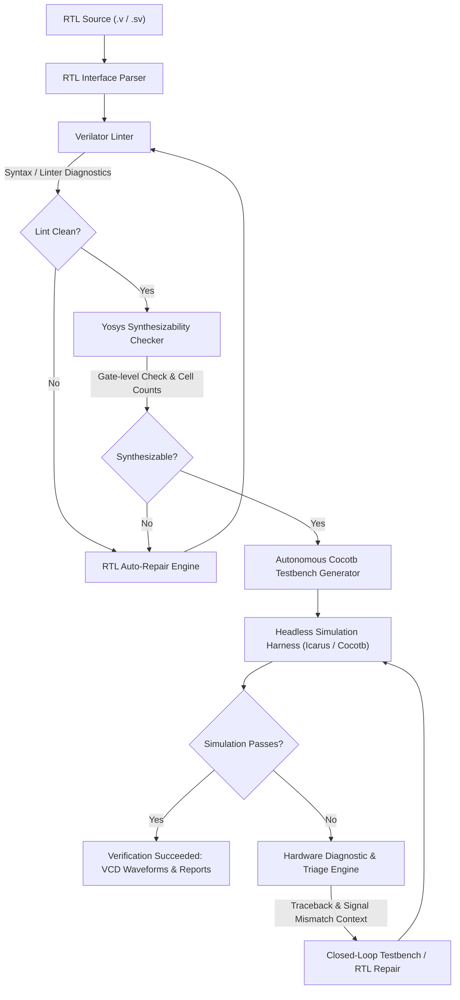

# EDA-Agent 🚀

[](https://opensource.org/licenses/Apache-2.0)
[](https://www.python.org/downloads/)
[](docker-compose.yml)
[](https://github.com/ashishsinghbora/eda-agent)
[](https://www.veripool.org/verilator/)
[](https://yosyshq.net/yosys/)
[](https://steveicarus.github.io/iverilog/)
[](https://www.cocotb.org/)

**EDA-Agent** is an industry-grade autonomous Electronic Design Automation (EDA) and VLSI verification assistant. It bridges hardware description languages (SystemVerilog/Verilog) with modern Python verification workflows (`cocotb`), providing automated RTL interface extraction, Verilator linting, Yosys gate-level synthesizability checking, testbench synthesis, closed-loop simulation self-repair, Static Timing Analysis (STA) diagnostics, and interactive waveform visualization.

---


---

## 🏛️ System Architecture & Autonomous Flow



### Key Modules:
- **`eda_agent.core`**: Master agent loop (`AgentLoop`), lifecycle state machine (`AgentStateMachine`), and airgapped LLM provider routing (`ModelRouter`).
- **`eda_agent.tools`**: Subprocess tool wrappers for Verilator (`verilator_linter`), Icarus/Cocotb (`sim_runner`), and Yosys (`synthesis_checker`).
- **`eda_agent.prompts`**: Hardware-specific prompt engineering enforcing IEEE 1800-2017 SystemVerilog, parameterized modules, active-low resets (`rst_n`), non-blocking (`<=`) sequential updates, and clean sensitivity lists.
- **`eda_agent.analyzers`**: Cocotb JUnit XML result aggregator (`coverage_analyzer`), digital engineering log translator (`human_diagnostics`), and OpenROAD/OpenSTA timing parser (`sta_analyzer`).
- **`eda_agent.parsers`**: AST & regex Verilog parser (`verilog_parser`) and VCD-to-WaveDrom waveform converter (`vcd_parser`).
- **`eda_agent.server`**: FastAPI backend with WebSocket verification streaming and interactive Web Studio dashboard.

---

## ⚡ Quickstart

### Prerequisites
- **Python 3.10+**
- **GNU Make**
- **Icarus Verilog (`iverilog`)** and **`vvp`**
- **Git Bash** on Windows. Cocotb's Makefiles use Unix shell utilities such as `sh`, `tr`, and `uname`.

The application can discover a repository-local toolchain under `.tools/iverilog/bin` and `.tools/make/bin`. This is useful on Windows when machine-wide installation requires administrator access. If no local tools are present, install GNU Make and Icarus Verilog through your operating system package manager and ensure both `iverilog` and `vvp` are on `PATH`.
### Option A: Zero-Dependency Docker Compose (Recommended)

Run the entire open-source EDA suite (Verilator, Icarus Verilog, Yosys, Python 3, Web UI) in isolated containers without installing EDA binaries on the host:

```bash
# 1. Clone the repository
git clone https://github.com/ashishsinghbora/eda-agent.git
cd eda-agent

# Set up Python virtual environment (Linux/macOS)
python3 -m venv .venv
source .venv/bin/activate

# Windows PowerShell equivalent
py -3 -m venv .venv
.\.venv\Scripts\Activate.ps1

# Install in editable mode
# 2. Launch containerized Web Studio & API server
docker compose up -d

# 3. Access Web Studio
open http://localhost:8000
```

To run CLI commands inside Docker:
```bash
docker compose run --rm eda-agent verify examples/rtl/alu_8bit.v
docker compose run --rm eda-agent lint examples/rtl/alu_8bit.v
```

---

### Option B: Bare-Metal Installation

#### Prerequisites
- **Python 3.10+** (Python 3.11+ recommended)
- **Icarus Verilog (`iverilog`)**, **`vvp`**, **`verilator`** (optional), and **`yosys`** (optional)

```bash
# Ubuntu / Debian
sudo apt-get update && sudo apt-get install -y iverilog verilator yosys build-essential make

# Arch Linux
sudo pacman -S iverilog verilator yosys make
```

#### Install Python Package
```bash
# Create and activate virtual environment
python3 -m venv .venv
source .venv/bin/activate

# Install EDA-Agent in editable mode
pip install -e .
```

### Windows: repository-local simulator setup

If you cannot install packages globally, unpack the 64-bit Icarus archive into `.tools/iverilog` so that these files exist:

```text
.tools/iverilog/bin/iverilog.exe
.tools/iverilog/bin/vvp.exe
```

This workspace includes the archive used for that setup under `hoco/ChocolateyScratch/iverilog/11.0.0/tools/_archives`. From the repository root, PowerShell can extract it with:

```powershell
New-Item -ItemType Directory -Force .tools/iverilog | Out-Null
Expand-Archive `
   -Path hoco/ChocolateyScratch/iverilog/11.0.0/tools/_archives/iverilog-mingw32-w64-x86_64-11.0.zip `
   -DestinationPath .tools/iverilog -Force
```

The GNU Make archive is not part of the Icarus package. Download or install a real GNU Make binary and place `make.exe` at `.tools/make/bin/make.exe`, or install it system-wide.

The repository's simulation runner automatically adds this directory to the subprocess `PATH`. It also looks for `.tools/make/bin/make.exe`, then a system `make`, and finally the virtual-environment fallback. A real GNU Make executable is required for the Cocotb Makefile; `pymake` is not compatible with Cocotb's conditional Makefile syntax.

For a normal Windows installation, install GNU Make and Icarus Verilog with an elevated package-manager shell, then open a new terminal so the updated `PATH` is visible:

```powershell
choco install iverilog make -y
```

Git Bash is normally installed with Git for Windows. The runner uses `C:\Program Files\Git\usr\bin\sh.exe` when it is available.

---

## 💻 CLI Commands & Usage

```bash
# Display help and available commands
eda-agent --help
```

| Command | Description | Example |
|---|---|---|
| `generate` | Synthesizes standalone Cocotb testbench in Python | `eda-agent generate examples/rtl/alu_8bit.v -o test_alu.py` |
| `lint` | Runs Verilator `--lint-only -Wall` with structured JSON | `eda-agent lint examples/rtl/alu_8bit.v --json-output` |
| `synth` | Runs Yosys gate-level synthesizability check & cell stats | `eda-agent synth examples/rtl/alu_8bit.v` |
| `verify` | End-to-end closed-loop verification & self-repair loop | `eda-agent verify examples/rtl/alu_8bit.v --max-retries 3` |
| `triage-log` | Translates raw simulator error logs into hardware root cause | `eda-agent triage-log sim.log --rtl examples/rtl/alu_8bit.v` |
| `assert` | Synthesizes SVA properties & Cocotb check coroutines | `eda-agent assert examples/rtl/fifo_async.v -s "ready drops low when full"` |
| `analyze-timing` | Parses OpenROAD/OpenSTA timing logs & provides RTL diffs | `eda-agent analyze-timing examples/logs/openroad_sta_violated.log` |
| `sim` | Executes Cocotb simulation directly in headless sandbox | `eda-agent sim --dir examples/sim --toplevel alu_8bit` |
| `config` | Manages local (Ollama/vLLM) and cloud LLM providers | `eda-agent config --provider ollama --model deepseek-coder-v2:16b` |
| `ui` | Launches FastAPI backend & interactive Web UI studio | `eda-agent ui --port 8000` |
| `info` | Displays environment status and detected EDA tool binaries | `eda-agent info` |

---

## 🔧 Concrete Examples

### 1. 8-Bit Parameterized ALU (`examples/rtl/alu_8bit.v`)

```verilog
`timescale 1ns / 1ps

module alu_8bit #(
    parameter DATA_WIDTH = 8
)(
    input  wire                  clk,
    input  wire                  rst_n,
    input  wire [DATA_WIDTH-1:0] a,
    input  wire [DATA_WIDTH-1:0] b,
    input  wire [2:0]            opcode,
    output reg  [DATA_WIDTH-1:0] result,
    output reg                   zero,
    output reg                   carry,
    output reg                   overflow
);
    // Combinational logic & synchronous registered outputs
    ...
endmodule
```

### 2. Auto-Generated Cocotb Testbench (`examples/sim/test_alu_8bit.py`)

```python
import random
import cocotb
from cocotb.clock import Clock
from cocotb.triggers import RisingEdge, Timer

async def reset_dut(dut):
    dut.rst_n.value = 0
    dut.a.value = 0
    dut.b.value = 0
    dut.opcode.value = 0
    await Timer(20, unit="ns")
    dut.rst_n.value = 1
    await RisingEdge(dut.clk)

@cocotb.test()
async def test_alu_8bit_functional(dut):
    """Verify functional ALU operations across randomized vectors."""
    cocotb.start_soon(Clock(dut.clk, 10, unit="ns").start())
    await reset_dut(dut)

    for op in range(8):
        for _ in range(15):
            a_val = random.randint(0, 255)
            b_val = random.randint(0, 255)

            dut.a.value = a_val
            dut.b.value = b_val
            dut.opcode.value = op

            await RisingEdge(dut.clk)
            await Timer(1, unit="ns")

### 6. Run Cocotb Simulation Directly
```bash
eda-agent sim --dir examples/sim --toplevel fifo_async --module test_fifo_async --clean
```

The simulation runner sets `SIM`, `TOPLEVEL`, `MODULE`, `SIM_BUILD`, and `WAVES` for the example Makefile. Build artifacts and Cocotb reports are written below `examples/sim/sim_build_<toplevel>`.

### 7. Launch Interactive Web UI Studio & FastAPI Backend
Start the local web application with real-time waveform visualization, live streaming terminal, dual code editor, and interactive SVG hardware schematics:

```bash
# Launch Web UI on http://127.0.0.1:8000
eda-agent ui --port 8000
```
- **Interactive Web Studio**: `http://127.0.0.1:8000`
- **Interactive OpenAPI Docs**: `http://127.0.0.1:8000/docs`
- **Real-Time WebSocket Stream**: `ws://127.0.0.1:8000/ws/verify`

#### Web UI Architecture & Capabilities:
- **Left Panel**: Target RTL module explorer, local LLM selector (Ollama status badge), natural language specification prompt input, and 1-click action buttons (*Run Verification*, *Auto-Fix RTL Bug*, *Explain Failure in Simple Terms*, *Export Testbench*).
- **Center Panel**: Dual code editor view (Verilog RTL on the left, auto-generated Cocotb testbench and SVA assertions on the right).
- **Right Panel (Top)**: Interactive SVG hardware block diagram rendering input/output ports, bit widths, clock domains, and reset pins.
- **Bottom Panel**: Live simulation terminal streaming compiler outputs (`iverilog`), testcase execution, and an interactive digital waveform viewer powered by WaveDrom.

#### Web UI workflow

1. Select `alu_8bit.v` or `fifo_async.v`, or choose **Custom RTL Buffer** and edit the RTL editor.
2. Enter a natural-language requirement or select a preset prompt. The **Synthesize TB** button calls `POST /api/generate-test` and updates the testbench editor.
3. Use the **testbench.py** and **SVA Assertions** tabs to switch between generated Cocotb code and generated SVA/checker code. SVA is generated when a specification is supplied.
4. Click **Refresh Diagram** after changing RTL. The UI calls `POST /api/parse` and redraws the module ports and schematic.
5. Click **Run Verification** to open `/ws/verify`. The server runs the generate, simulate, diagnose, and repair loop, streams iteration records, and displays any WaveDrom data produced by the simulation.
6. **Auto-Fix RTL Bug** starts the same closed-loop verification flow and labels the terminal output as a repair run.
7. **Explain Failure in Simple Terms** sends the latest simulator output and RTL to `POST /api/diagnose`, then displays the engineering summary, hardware diagnosis, and raw error.
8. **Analyze Static Timing (STA)** sends the latest available log to `POST /api/timing` and displays WNS, TNS, timing status, and recommendations. It requires an OpenSTA/Yosys-style timing log; ordinary simulator output may parse as a clean report with zero metrics.
9. **Refresh Wave** displays the latest captured waveform. If no simulation waveform exists yet, it displays the built-in sample waveform as a visual placeholder.
10. The provider selector persists the selected provider through `POST /api/config/provider`. It changes the configured inference backend; it does not install or start Ollama, vLLM, Gemini, or OpenAI services.
11. **Export Testbench** downloads the generated Cocotb testbench as `test_<module>.py`.

#### Backend endpoints

| Endpoint | Purpose |
|---|---|
| `GET /api/status` | Python, simulator, and LLM configuration status |
| `GET /api/examples` | Bundled RTL examples and specification presets |
| `POST /api/parse` | Parse RTL and return module metadata |
| `POST /api/generate-test` | Generate a Cocotb testbench and optional SVA checker |
| `POST /api/diagnose` | Translate simulator failures into hardware diagnostics |
| `POST /api/timing` | Parse OpenSTA/Yosys timing reports |
| `POST /api/config/provider` | Persist the selected LLM provider |
| `WS /ws/verify` | Stream verification and repair-loop events |

### Verification troubleshooting

The UI checks `/api/status` on startup. If either `iverilog` or `vvp` is missing, it intentionally shows **Simulator unavailable** and disables the verification workflow. This is a prerequisite warning, not a WebSocket failure.

Check the status directly:

```powershell
Invoke-RestMethod http://127.0.0.1:8000/api/status
```

Verification is ready only when the response contains non-null paths for both `iverilog` and `vvp`. After installing or unpacking the tools, restart the server and reload the browser page. On Windows, also confirm Git Bash exists at `C:\Program Files\Git\usr\bin\sh.exe`.

Common failure messages:

- **`Simulator unavailable`**: Icarus or VVP is not discoverable. Check `.tools/iverilog/bin` or system `PATH`.
- **`make: ... No rule to make target`**: GNU Make is missing or a Python `pymake` substitute is being selected. Install real GNU Make or place it at `.tools/make/bin/make.exe`.
- **`tr is not recognized` / `uname ... failed`**: Git Bash utilities are not available to the Make subprocess. Install Git for Windows and restart the server.
- **Port 8000 already in use**: use another port, for example `eda-agent ui --port 8001`, then open `http://127.0.0.1:8001`.
- **Ollama connection warnings**: the generator falls back to the built-in rule-based engine when the configured LLM endpoint is unavailable. Simulation still requires the simulator toolchain.

### 8. Check Environment & Toolchain
```bash
eda-agent info
            assert int(dut.result.value) == expected_alu_model(a_val, b_val, op)
```

---

## 🧪 Testing & Quality Assurance

Run the comprehensive pytest suite:

```bash
pytest -v
```

---

## 📄 License

This project is licensed under the [Apache-2.0 License](LICENSE).
